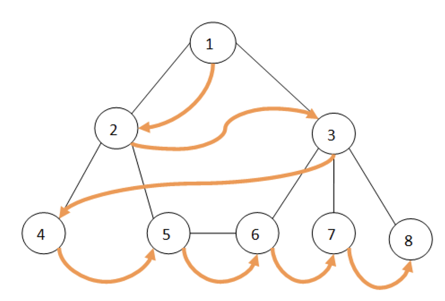

# UT7 y UT8 Grafos

# Grafos Dirigidos
## Método bea (busqueda en amplitud)
Se recorre los nodos de un grafo, comenzando en la raíz para luego explorar todos los vecinos de este nodo.
Luego para cada uno de los vecinos se exploran sus respectivos vecinos adyacentes, y así hasta que se recorra todo el grafo. 

***
- Método a nivel del grafo
```java
@Override
public Collection<TVertice> bea(Comparable etiquetaOrigen) {
   if(this.getVertices().get(etiquetaOrigen) != null){
        LinkedList<TVertice> recorrido = new LinkedList<>();
        TVertice v = this.getVertices().get(etiquetaOrigen);
        v.bea(recorrido);
        return recorrido;
    }
    return null;
}
```
- Método a nivel del vértice
```java
@Override
public void bea(Collection<TVertice> visitados) {
    Queue<TVertice> queue = new LinkedList<>();
    this.setVisitado(true); // Lo visito
    queue.add(this);
    visitados.add(this); // Lo agrego a visitados

    while(!queue.isEmpty()){
        TVertice x = queue.poll();
        LinkedList<TAdyacencia> adyacencias = x.getAdyacentes();
        for(TAdyacencia y : adyacencias){
            TVertice j = y.getDestino();
            if(!j.getVisitado()){
                j.setVisitado(true);
                queue.add(j);
                visitados.add(j);
            }
        }
    }
}
```
## Método bpf (busqueda por profundidad)
- Se puede emplear el mismo algoritmo definido para *grafos dirigidos y no dirigidos*.
- En este caso, si el grafo es conexo, de la búsqueda en profundidad se obtiene un sólo árbol
- Para grafos no dirigidos, hay dos clases de arcos: de árbol y de retroceso.

***
- Método a nivel del grafo
```java
@Override
public void bpf(Collection<TVertice> visitados) {
    setVisitado(true);
    visitados.add(this);
    for (TAdyacencia adyacente : adyacentes) {
        TVertice vertAdy = adyacente.getDestino();
        if (!vertAdy.getVisitado()) {
            vertAdy.bpf(visitados);
        }
    }
}
```
- Método a nivel del vértice 
```java
@Override
public void bpf(Collection<TVertice> visitados) {
    setVisitado(true);
    visitados.add(this);
    for (TAdyacencia adyacente : adyacentes) {
        TVertice vertAdy = adyacente.getDestino();
        if (!vertAdy.getVisitado()) {
            vertAdy.bpf(visitados);
        }
    }
}
```
[BEA y BPF](https://www.encora.com/es/blog/dfs-vs-bfs)

# Método todos los caminos
Método a nivel del grafo
```java
@Override
public TCaminos todosLosCaminos(Comparable etiquetaOrigen, Comparable etiquetaDestino) {
    desvisitarVertices();
    TVertice origen = vertices.get(etiquetaOrigen);
    TCamino camino = new TCamino(origen);
    TCaminos resultado = new TCaminos();
    origen.todosLosCaminos(etiquetaDestino, camino, resultado);
    return resultado;
}
```

Método a nivel del vértice
```java
@Override
public TCaminos todosLosCaminos(Comparable etVertDest, TCamino caminoPrevio, TCaminos todosLosCaminos) {
    visitado = true;
    for(TAdyacencia adyacente : adyacentes){
        TVertice destino = adyacente.getDestino();
        if(!destino.getVisitado()){
            TCamino copia = caminoPrevio.copiar();
            copia.agregarAdyacencia(adyacente);
            if(destino.getEtiqueta().compareTo(etVertDest) == 0){
                todosLosCaminos.getCaminos().add(copia);
            }else{
                adyacente.getDestino().todosLosCaminos(etVertDest, copia, todosLosCaminos);
            }
        }
    }
    visitado = false;
    return todosLosCaminos;
}
```
## Algoritmo de FLOYD
```java
@Override
    public Double[][] floyd() {
        Double[][] matriz = UtilGrafos.obtenerMatrizCostos(getVertices());
        int capacidad = matriz[0].length;
        Double[][] matrizFloyd = new Double[capacidad][capacidad];
        for (int i = 0; i < capacidad; i++){
            for (int j = 0; j < capacidad; j++){
                if (i != j){
                    matrizFloyd[i][j] = (double) (j + 1);
                }
            }
        }
        for (int k = 0; k < capacidad; k++){
            for (int i = 0; i < capacidad; i++){
                for (int j = 0; j < capacidad; j++){
                    if(matriz[i][k] + matriz[k][j] < matriz[i][j]){
                        matriz[i][j] = matriz[i][k] + matriz[k][j];
                        matrizFloyd[i][j] = matrizFloyd[i][k];
                    }
                }
            }
        }
        return matrizFloyd;
    }
```

## Algoritmo de WARSHALL
```java
public boolean[][] warshall() {
        Double[][] matrizCostos = UtilGrafos.obtenerMatrizCostos(getVertices());
        boolean[][] matrizWarshall = new boolean[matrizCostos.length][matrizCostos.length];
        for (int i = 0; i < matrizCostos.length; i++) {
            for (int j = 0; j < matrizCostos.length; j++) {
                matrizWarshall[i][j] = false;

                if (i != j && matrizCostos[i][j] != Integer.MAX_VALUE) {
                    matrizWarshall[i][j] = true;
                }
            }
        }
        for (int k = 0; k < matrizWarshall.length; k++) {
            for (int i = 0; i < matrizWarshall.length; i++) {
                for (int j = 0; j < matrizWarshall.length; j++) {
                    if ((i != k) && (k != j) && (i != j)) {
                        if (!matrizWarshall[i][j]) {
                            matrizWarshall[i][j] = matrizWarshall[i][k] && matrizWarshall[k][j];
                        }
                    }
                }
            }
        }
        return matrizWarshall;
    }
```
# Grafos no Dirigidos

## Algoritmo de PRIM
```java
@Override
    public TGrafoNoDirigido Prim() {
        Collection<Comparable> V = new ArrayList<>();
        Collection<Comparable> U = new ArrayList<>();
        Collection<TArista> AristasAAM = new ArrayList<>();
        double costoPrim = 0;

        for (TVertice vertice : this.getVertices().values()) {
                V.add(vertice.getEtiqueta());
        }

        U.add(V.iterator().next());
        V.remove(V.iterator().next());

        while (V.size() != 0) {
            TArista tempArista = this.lasAristas.buscarMin(U, V);
            AristasAAM.add(tempArista);
            V.remove(tempArista.getEtiquetaDestino());
            U.add(tempArista.getEtiquetaDestino());
            costoPrim = costoPrim + tempArista.getCosto();
        }

        Collection<TVertice> VerticesSeleccionados = new ArrayList<>();

        for (Comparable vertice : U) {
            VerticesSeleccionados.add(new TVertice(vertice));
        }

        return new TGrafoNoDirigido(VerticesSeleccionados, AristasAAM);
    }
```
