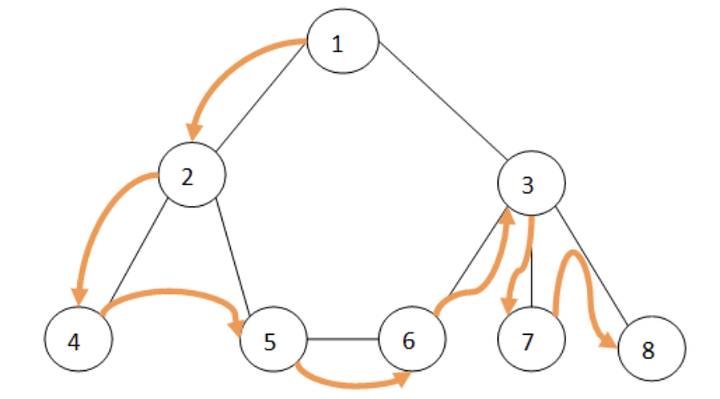

# UT7 y UT8 Grafos

# Grafos Dirigidos

## Método bpf (busqueda por profundidad)

- Método a nivel del grafo
```java
@Override
public void bpf(Collection<TVertice> visitados) {
    setVisitado(true);
    visitados.add(this);
    for (TAdyacencia adyacente : adyacentes) {
        TVertice vertAdy = adyacente.getDestino();
        if (!vertAdy.getVisitado()) {
            vertAdy.bpf(visitados);
        }
    }
}
```
- Método a nivel del vértice 
```java
@Override
public void bpf(Collection<TVertice> visitados) {
    setVisitado(true);
    visitados.add(this);
    for (TAdyacencia adyacente : adyacentes) {
        TVertice vertAdy = adyacente.getDestino();
        if (!vertAdy.getVisitado()) {
            vertAdy.bpf(visitados);
        }
    }
}
```

# Método todos los caminos
Método a nivel del grafo
```java
@Override
public TCaminos todosLosCaminos(Comparable etiquetaOrigen, Comparable etiquetaDestino) {
    desvisitarVertices();
    TVertice origen = vertices.get(etiquetaOrigen);
    TCamino camino = new TCamino(origen);
    TCaminos resultado = new TCaminos();
    origen.todosLosCaminos(etiquetaDestino, camino, resultado);
    return resultado;
}
```

Método a nivel del vértice
```java
@Override
public TCaminos todosLosCaminos(Comparable etVertDest, TCamino caminoPrevio, TCaminos todosLosCaminos) {
    visitado = true;
    for(TAdyacencia adyacente : adyacentes){
        TVertice destino = adyacente.getDestino();
        if(!destino.getVisitado()){
            TCamino copia = caminoPrevio.copiar();
            copia.agregarAdyacencia(adyacente);
            if(destino.getEtiqueta().compareTo(etVertDest) == 0){
                todosLosCaminos.getCaminos().add(copia);
            }else{
                adyacente.getDestino().todosLosCaminos(etVertDest, copia, todosLosCaminos);
            }
        }
    }
    visitado = false;
    return todosLosCaminos;
}
```

# Grafos no Dirigidos

when.
